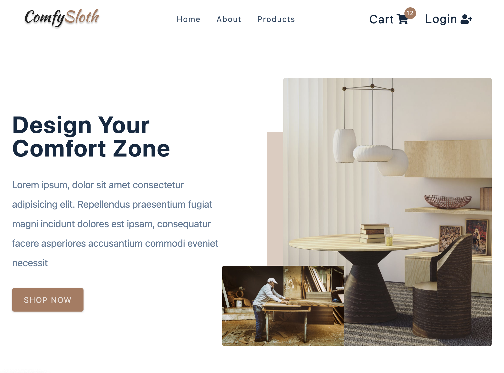

<h1 align="center">
    
</h1>

<p align="center">
  <a href="#-technologies">Technologies</a>&nbsp;&nbsp;&nbsp;|&nbsp;&nbsp;&nbsp;
  <a href="#-layout">Getting started</a>&nbsp;&nbsp;&nbsp;|&nbsp;&nbsp;&nbsp;
  <a href="#-project">Project</a>&nbsp;&nbsp;&nbsp;|&nbsp;&nbsp;&nbsp;
  <a href="#-layout">Layout</a>&nbsp;&nbsp;&nbsp;|&nbsp;&nbsp;&nbsp;
  <a href="#-license">License</a>
</p>

<p align="center">
  
  
  

  
</p>

<br>

<p align="center">
  
</p>

## 👨🏻‍💻 Status

In Progress

## 🧪 Technologies

This project was developed using the following technologies:

- [React](https://reactjs.org)
- [Styled Components](https://styled-components.com/)
- [Axios](https://www.npmjs.com/package/axios)
- [Auth0](http://www.auth0.com)
- [React Router](https://reactrouter.com/)

## 🚀 Getting started

Clone the project and access the folder

```bash
$ git clone https://github.com/JorgeFPeres/Project_Ecommerce_React.git && cd Project_Ecommerce_React
```

Follow the steps below

```bash
# Install the dependencies
$ npm install

# Start the project
$ npm start
```

## 💻 Project

[Comfy Sloth](#) a new way to experience the shopping! 💜

This is a project developed by me, during April and March, 2021.

## 📝 License

This project is licensed under the MIT License. See the [LICENSE](LICENSE.md) file for details.

---

<p align="center">Made with ❤️ by Jorge F Peres</p>
